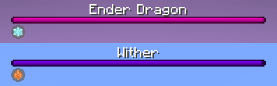

# Fixing Boss Bar Displays

Bosses may have elements applied to them. Since they could be big (ex. Ender Dragon), it's quite hard to see the element currently applied on them. For a better experience, the currently applied elements on bosses are displayed at the bottom of the boss bar.

<p align="center">
	
</p>

However, this doesn't work for custom bosses, immediately.

## Data pack method

If your data pack features a custom boss and you want applied elements to render for their bossbar, simply use the `/bossbar` command!

```mcfunction
bossbar set <id> entity <entity>
```

This will link the entity to the bossbar, and any elements they have currently inflicted will be displayed under their boss bar like the Ender Dragon and Wither!

## Mod method

If your mod features a custom boss and you want applied elements to render for their bossbar, simply use the `IBossBar#sevenelements$setEntity` method!

Do note that a `LivingEntity` is required as the boss!

```java
bossbar.sevenelements$setEntity(customBossEntity);
```

This will link the entity to the bossbar, and any elements they have currently inflicted will be displayed under their boss bar like the Ender Dragon and Wither!

You can directly use the `sevenelements$setEntity` on the `BossBar` instance, as Seven Elements marks it as an [Injected Interface](https://wiki.fabricmc.net/tutorial:interface_injection).

Seven Elements will also automatically take care of syncing this data to the necessary clients, so you don't need to worry about adding a sync payload/packet and deal with more networking!