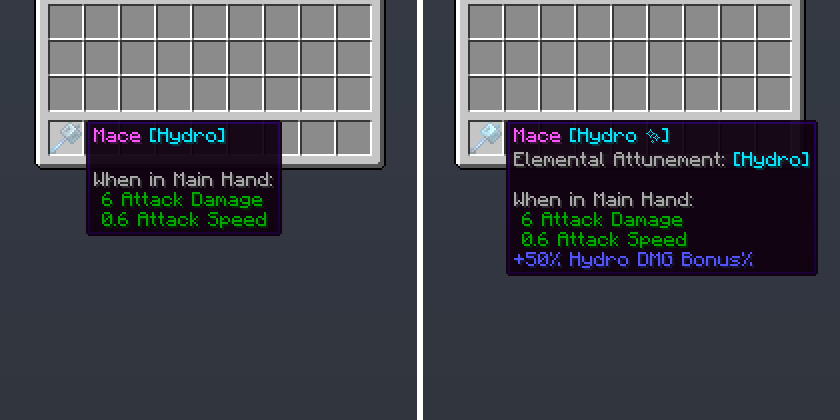
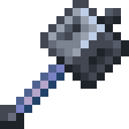
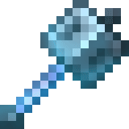

# Elemental Attunement

In Seven Elements, you may attune specific items to the elements by using an [Elemental Attunement Smithing Template](../../wiki/items/Elemental%20Attunement%20Smithing%20Template.md), allowing you to deal stronger elemental damage or protect yourself from elemental damage.

Attuning an item will grant you an elemental DMG Bonus% based on the attuned element upon holding the item, while attuning a piece of equippable armor will instead grant you elemental RES% based on the attuned element upon equipping the item.

Attuned items also may no longer be infused with a different element other than the attuned element upon infusing it in the [Infusion Table](../../wiki/blocks/Infusion%20Table.md).

When an item is infused with an element matching the attunement, its item display is different, having the "✨" symbol appended with its infusion text.

In addition to this, the item will also have a custom glint to indicate it's been attuned and infused with the same element. This replaces the enchantment glint entirely.

	
	
	
	
	
A normal Mace

	
A Hydro-infused   Mace

	
An enchanted   Hydro-infused Mace

	
A Hydro-attuned and infused Mace

