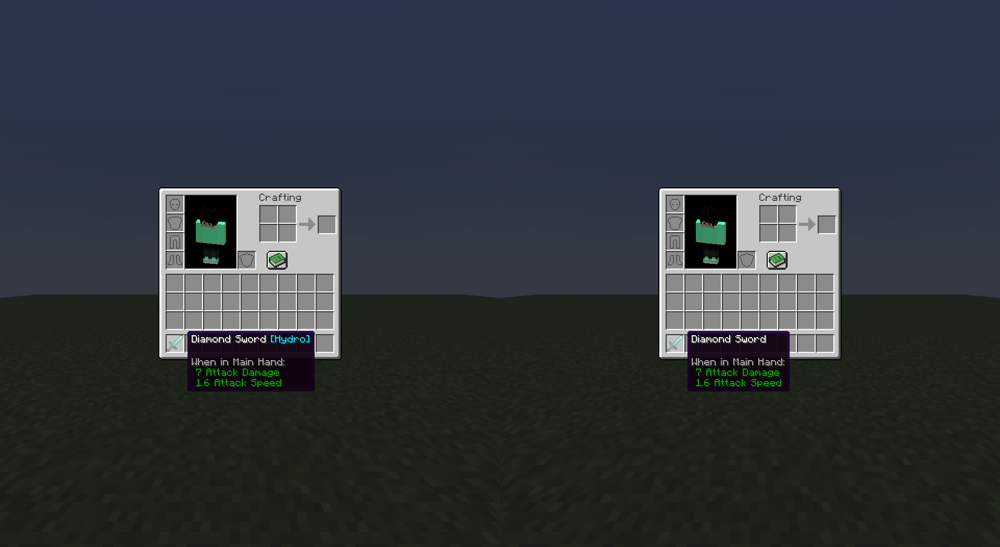

# Elemental Combat

Seven Elements expands upon Minecraft's combat, adding an *Elemental* alignment to attacks, which can be applied onto entities and trigger various [Elemental Reactions](./elemental_reactions.md).

Upon attacking an enemy with an instance of damage aligned with the Elements, the corresponding Element is applied onto the target, when possible.

There are 8 damage types: [the Seven Elements](./the_seven_elements.md); **Pyro**, **Hydro**, **Anemo**, **Electro**, **Dendro**, **Cryo**, and **Geo**, as well as **Physical**, the non-Element damage type. 

Any instance of damage not aligned with an Element is considered **Physical**.

## Elemental Infusion

When using the [Infusion Table](../workstations/infusion_table.md) or the [/element](../misc/commands/element) command, an item may be infused with an element.

When an item is infused with an element, its elemental infusion is appended at the end of its name.

This infusion has the **highest** priority, and will take effect **first** before succeeding infusion methods given that the damage being dealt does not have an elemental infusion or is dealing **Physical DMG**.

Depending on the item infused, Elemental Damage may be dealt in different methods.

### Direct Elemental Damage

For most items and weapons, you **must** deal damage with the infused item to deal elemental damage.

For example, when you hit a target with an item infused with **Hydro**, the target will take **Hydro DMG**.

This also means that if you infused an [End Crystal](https://minecraft.wiki/w/End_Crystal) with an element, placed it and detonated it, it will instead deal **Pyro DMG** (due to `minecraft:explosion` [Elemental Damage Source](#elemental-damage-sources)) instead of the element you infused it with.

### Indirect Elemental Damage

For supported items like the [Bow](https://minecraft.wiki/w/Bow), [Crossbow](https://minecraft.wiki/w/Crossbow) and [Trident](https://minecraft.wiki/w/Trident), the shot projectile/thrown Trident will be infused with the element the item is infused with, and will deal elemental damage.

For infused projectiles loaded into a [Bow](https://minecraft.wiki/w/Bow) or [Crossbow](https://minecraft.wiki/w/Crossbow) such as [Arrows](https://minecraft.wiki/w/Arrow) and [Firework Rockets](https://minecraft.wiki/w/Firework_Rocket), their infusions will **not** apply, regardless of whether the Bow or Crossbow the projectile is loaded into has an existing elemental infusion.

For non-supported items like the [Snowball](https://minecraft.wiki/w/Snowball) and [Egg](https://minecraft.wiki/w/Egg), the shot projectile will **not** be infused with the element the item is infused with. As a result, elemental damage **must** be dealt in the same method as [Direct Elemental Damage](#direct-elemental-damage): hitting the entity with the item itself.

## Elemental Damage Sources

Some damage sources like `minecraft:freeze` (from [Powdered Snow's Freeze DMG](https://minecraft.wiki/w/Powder_Snow#Freezing)), [`minecraft:drown`](https://minecraft.wiki/w/Damage#Drowning), and [`minecraft:explosion`](https://minecraft.wiki/w/Explosion#Damage) have innate Elemental infusions tied to them.

Like [Mob Elemental Damage](#mob-elemental-damage), these elemental damage instances apply **1 [gauge unit](./elemental_gauge_theory.md#elemental-gauge-theory)** of their corresponding Element, given that the element can be an [Aura Element](./elemental_gauge_theory.md#elemental-auras-and-the-aura-tax)

This infusion has the **second** highest priority, and will take effect before succeeding infusion methods given that the damage being dealt does not have an elemental infusion or is dealing **Physical DMG**.

## Mob Elemental Damage

Some mobs like the [Drowned](https://minecraft.wiki/w/Drowned), [Stray](https://minecraft.wiki/w/Stray), and the [Snow Golem](https://minecraft.wiki/w/Snow_Golem) now deal elemental damage.

These elemental damage instances apply **1 [gauge unit](./elemental_gauge_theory.md#elemental-gauge-theory)** of their corresponding Element, given that the element can be an [Aura Element](./elemental_gauge_theory.md#elemental-auras-and-the-aura-tax)

This infusion has the **third** highest priority, and will take effect before succeeding infusion methods given that the damage being dealt does not have an elemental infusion or is dealing Physical DMG.

## Natural Element Sources

In **Seven Elements**, there are a couple of ways you can be applied with an element **naturally**!

When in fire, **Pyro** is automatically applied on you!

This can be toggled with the `pyroFromFire` gamerule!

	<video width="95%" height="auto" controls>
		<source src="../media/elements/pyro_from_fire.mp4" type="video/mp4">
		Your browser does not support the video tag.
	</video>

 

When in water, **Hydro** is automatically applied on you!

This can be toggled with the `hydroFromWater` gamerule!

	<video width="95%" height="auto" controls>
		<source src="../media/elements/hydro_from_water.mp4" type="video/mp4">
		Your browser does not support the video tag.
	</video>

 

When struck by lightning, **Electro** is automatically applied on you!

This can be toggled with the `electroFromThunder` gamerule!

	<video width="95%" height="auto" controls>
		<source src="../media/elements/electro_from_thunder.mp4" type="video/mp4">
		Your browser does not support the video tag.
	</video>

## Implementation

The implementation of elements in **Seven Elements** aims to resemble that of Genshin Impact's while being inherently unique code-wise.

As much as possible, **Seven Elements** wishes a one-to-one recreation of the Elemental system from Genshin Impact. As such, all *quirks* above are expected to work in the same way in **Seven Elements**.

However, there are *some* changes upon *transposing* the Elemental system into Minecraft, ensuring a proper integration with Minecraft rather than a "I made Minecraft into Genshin" moment.

### Cryo Status

When afflicted with the **Cryo** element, your Movement Speed and Attack Speed is decreased multiplicatively by 15%, Seven Elements's *translation* of Genshin Impact's "-15% Animation Speed" in Minecraft.

This effect is **permanent** while the **Cryo** element exists, and is immediately removed upon being unaffected by **Cryo**.

### Pyro DMG and Fire-related effects

[Fire Resistance](https://minecraft.wiki/w/Fire_Resistance) and [Fire Protection](https://minecraft.wiki/w/Fire_Protection) will **not** modify any instance of **Pyro DMG**, to be fair with the other elemental damage types.

The amount of **Pyro DMG** an entity takes with and without [Fire Resistance](https://minecraft.wiki/w/Fire_Resistance) and/or [Fire Protection](https://minecraft.wiki/w/Fire_Protection) will remain the same. **However**, if the [damage type **tag**](https://minecraft.wiki/w/Damage_type_tag_(Java_Edition)) is of `minecraft:is_fire`, **only** then will [Fire Resistance](https://minecraft.wiki/w/Fire_Resistance) and/or [Fire Protection](https://minecraft.wiki/w/Fire_Protection) affect the damage dealt, even if **Pyro DMG** is dealt.

**Pyro DMG** is only **not** modified by [Fire Resistance](https://minecraft.wiki/w/Fire_Resistance) and/or [Fire Protection](https://minecraft.wiki/w/Fire_Protection) **if** its damage type tag is not of `minecraft:is_fire`.

### Damage Type Tags

**All** DMG dealt from reactions:

- Bypasses Minecraft's DMG cooldown ([`#minecraft:bypasses_cooldown`](https://minecraft.wiki/w/Damage_type_tag_(Java_Edition)#bypasses_cooldown))
- Bypasses Shields ([`#minecraft:bypasses_shields`](https://minecraft.wiki/w/Damage_type_tag_(Java_Edition)#bypasses_shields))
- Has no impact ([`#minecraft:no_impact`](https://minecraft.wiki/w/Damage_type_tag_(Java_Edition)#no_impact))
- Does no knockback ([`#minecraft:no_knockback`](https://minecraft.wiki/w/Damage_type_tag_(Java_Edition)#no_knockback))
- Doesn't trigger the DMG cooldown ([`#seven-elements:prevents_cooldown_trigger`](../../developer/data_pack/damage_type_tag.md#prevents_cooldown_trigger))

Unlike **Genshin Impact**, Transformative Reactions (e.g. Overloaded, Superconduct) may also be affected by DMG-amplifying effects such as Protection and Resistance (DMG% Down).

**Overloaded** and **Burning** are considered "Fire" DMG ([`#minecraft:is_fire`](https://minecraft.wiki/w/Damage_type_tag_(Java_Edition)#is_fire)). This means that disabling `fireDamage` or having the [Fire Resistance](https://minecraft.wiki/w/Fire_Resistance) effect will nullify both **Overloaded** and **Burning** DMG. Likewise, the [Fire Protection](https://minecraft.wiki/w/Fire_Protection) enchantment also reduces the DMG received from these reactions.

**Overloaded** is also considered "Explosion" DMG ([`#minecraft:is_explosion`](https://minecraft.wiki/w/Damage_type_tag_(Java_Edition)#is_explosion)). This means that the [Blast Protection](https://minecraft.wiki/w/Blast_Protection) enchantment reduces the DMG received from the **Overloaded** reaction.

**Electro-Charged** is considered "Lightning" DMG ([`#minecraft:is_lightning`](https://minecraft.wiki/w/Damage_type_tag_(Java_Edition)#is_lightning)). However, this will not "transform" mobs upon being hit (e.g. Villager to Witch), as this Damage type tag only dictates if turtles drop bowls upon being killed, as described by the [Minecraft Wiki](https://minecraft.wiki/w/Damage_type_tag_(Java_Edition)#is_lightning:~:text=Used%20to%20make%20turtles%20drop%20bowls%20when%20killed%20by%20lightning.).

The **Shatter** reaction is now triggered **if** the target receives **any** form of **Geo DMG** **or** when they are **directly** hit by a [Heavy Weapon](../../developer/data_pack/item_tag.md#heavy_weapon), as no concept of "Blunt Attacks" (a.k.a "Heavy Attacks") and "Poise" exists in Minecraft and are not easily addable with respect to other mods.

Unlike **Genshin Impact**, **Dendro DMG** originating from the [Bloom](./elemental_reactions/bloom.md) reactions and its derivatives are **not limited** to **2** per **0.5s**. This means that an entity can take multiple amounts of **Dendro DMG** in a short timeframe without the others being ignored.