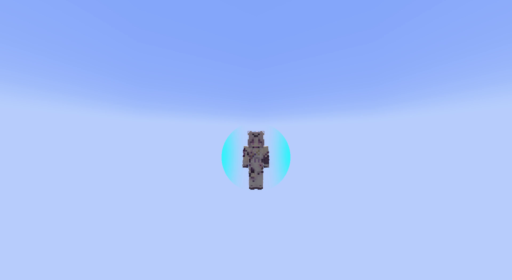

# Crystallize
&nbsp; &nbsp; < [Elemental Reactions](../elemental_reactions.md)

Crystallize is the [Elemental Reaction](../elemental_reactions.md) triggered when **Geo** is applied onto an entity already affected by **Pyro**/**Electro**/**Hydro**/**Cryo**.

Crystallize deals **no damage**. Instead, it generates a matching **Pyro**, **Electro**, **Hydro**, or **Cryo** [Elemental Shard](#elemental-shard) in front of the entity that can be picked up to gain an Crystallize Shield of the corresponding element.

	<video width="95%" height="auto" controls>
		<source src="../../media/elemental_reactions/crystallize.mp4" type="video/mp4">
		Your browser does not support the video tag.
	</video>

## Elemental Shard

Elemental Shards last on the field for 15 seconds, and can be picked up to gain an Crystallize Shield of the corresponding element.

Elemental Shards can only be picked up by the entity that triggered Crystallize for **7.5** seconds. After this duration, the Elemental Shard can be picked up by any entity, including the entity Crystallize was triggered on.

## Crystallize Shield

When you are about to take damage, the incoming damage is **absorbed** by the Crystallize Shield so long as it has *health* left. When incoming damage is **absorbed** by the Crystallize Shield, you will not take damage knockback, Once the Crystallize Shield expires or is broken, you will receive DMG and knockback normally again.

If a Crystallize shield doesn't have enough health to **fully absorb** the damage received, the excess damage left is dealt to you. Excess damage wil **not** apply knockback.

Shields made from the other elements (**Pyro**, **Hydro**, **Electro**, etc.) all have **250%** "effectiveness" against DMG from their corresponding element.

**Geo** Shields have **150%** "effectiveness" against DMG from their corresponding element.

For sister elements (**Frozen**, **Quicken**, **Burning**), they also have **250%** "effectiveness" against DMG from their corresponding element. However, this does not apply to their correspoding parent elements, i.e. **Frozen** only has **100%** effectiveness against **Cryo DMG**, and likewise vice versa, i.e. **Cryo** only has **100%** effectiveness against **Frozen DMG**.

It is also important to note that you, under any circumstance, should **never** be taking DMG from sister elements in a normal playthrough.

A shield's "effectiveness" determines how well it absorbs DMG from that element. The DMG Crystallize Shields take is given by the formula below:

$$
\text{DMG Taken}_\text{Crystallize Shield} = \frac{\text{DMG Incoming}}{\text{\% Element Bonus}}
$$

where $\text{\% Element Bonus} = \frac{\text{Effectiveness \%}}{100}$.

For instance, when an **Electro** Crystallize Shield receives **Electro DMG**, it's only damaged by **40%** of the original **Electro DMG** $(\frac{1}{2.5} = 0.4)$. If it instead receives **Pyro DMG**, it takes **100%** of the original **Pyro DMG** $(\frac{1}{1} = 1)$.

If the damage exceeds the Crystallize Shield's health, the excess DMG is dealt to you, which is given by the formula below:

$$
\text{DMG Taken} = \text{DMG Taken}_\text{Excess} \times \text{\% Element Bonus}
$$

The Crystallize Shield **does not** apply its effectiveness on the excess DMG.

### Internal Data

Reaction Multiplier (Crystallize Shield Health): **1**  
Reaction ID(s): 

- `seven-elements:crystallize_pyro` (triggered on the **Pyro** aura)
- `seven-elements:crystallize_hydro` (triggered on the **Hydro** aura)
- `seven-elements:crystallize_electro` (triggered on the **Electro** aura)
- `seven-elements:crystallize_cryo` (triggered on the **Cryo** aura)
- `seven-elements:crystallize_frozen` (triggered on the **Freeze** aura) 