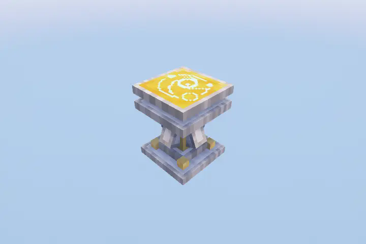
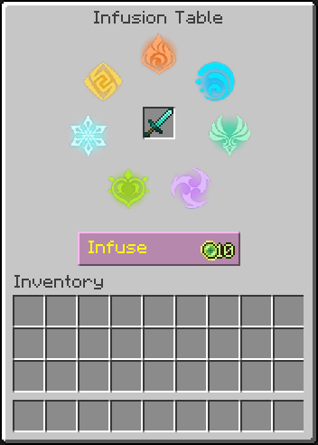

	    
	<b>Seven Elements</b> is a Minecraft mod that brings Genshin Impact's Elemental Combat System to Minecraft with the goal of staying faithful to the systems that hold it such as the <a href="https://genshin-impact.fandom.com/wiki/Elemental_Gauge_Theory">Elemental Gauge Theory</a> and <a href="https://genshin-impact.fandom.com/wiki/Internal_Cooldown">Internal Cooldown</a> while ensuring a smooth integration within Minecraft.

## Getting Started

It all starts with the [Infusion Table](./workstations/infusion_table.md).

	

The **Infusion Table**, like the Enchanting Table, is a block used to infuse your items with the power of the elements!

To begin, pick a item you want to be infused with and click **Infuse**. This will cost **10** experience levels, so make sure you have enough!

	

Once done, the selected item will be **permanently** infused with a random Element, and will now deal damage of that element!

Experiment with various elemental combos and master the elements to your advantage!

Alternatively, click [here](./elements/the_seven_elements.md) for a guide to the elements!

	<b>© All rights reserved by HoYoverse. Other properties belong to their respective owners.</b>

	<b>THIS PROJECT IS NOT AFFILIATED WITH NEITHER HOYOVERSE NOR GENSHIN IMPACT.</b>

	<b>Copyright © 2025 xrickastley (_xRickAstley). All Rights Reserved.</b>

  <b>Special thanks to YaBoiYin (yin_n_yang) on Discord for the entity models!</b>

