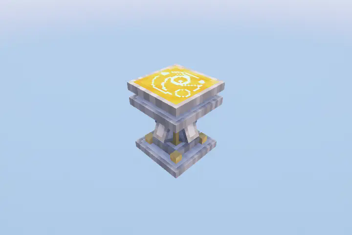
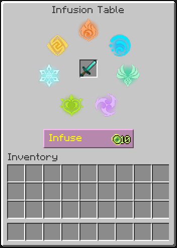

	    
	<b>Seven Elements</b> is a Minecraft mod that brings Genshin Impact's Elemental Combat System to Minecraft with the goal of staying faithful to the systems that hold it such as the <a href="https://genshin-impact.fandom.com/wiki/Elemental_Gauge_Theory">Elemental Gauge Theory</a> and <a href="https://genshin-impact.fandom.com/wiki/Internal_Cooldown">Internal Cooldown</a> while ensuring a smooth integration within Minecraft.

Tired of standard vanilla combat? Ever wanted to spice things up a little bit?

<b>Seven Elements</b> is a Minecraft mod that brings Genshin Impact's intricate Elemental Combat System to Minecraft, introducing Elements into the game. With two elements, trigger various reactions and harness the elements to your advantage!

Download the mod from <a href="https://modrinth.com/mod/seven-elements">Modrinth</a> or <a href="https://www.curseforge.com/minecraft/mc-mods/seven-elements">CurseForge</a>!

## Getting Started

It all starts with the [Infusion Table](../wiki/blocks/Infusion%20Table.md).

	

The **Infusion Table**, like the Enchanting Table, is a block used to infuse your items with the power of the elements!

To begin, pick a item you want to be infused with and click **Infuse**. This will cost **10** experience levels, so make sure you have enough!

	

Once done, the selected item will be **permanently** infused with a random Element, and will now deal damage of that element!

Experiment with various elemental combinations and master the elements to your advantage!

Alternatively, click [here](./elements/The%20Seven%20Elements.md) for a more direct guide to the elements!

	<b>© All rights reserved by HoYoverse. Other properties belong to their respective owners.</b>

	<b>THIS PROJECT IS NOT AFFILIATED WITH NEITHER HOYOVERSE NOR GENSHIN IMPACT.</b>

	<b>Copyright © 2025 xrickastley (_xRickAstley). All Rights Reserved.</b>

#### Special thanks to:
- YaBoiYin (yin_n_yang @ Discord) - Entity Models
- [LW-Arqiu1shz](https://github.com/LW-Arqiu1shz) - ZH-CN localization