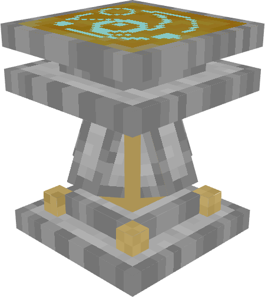
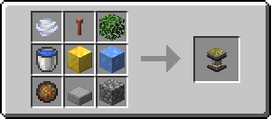
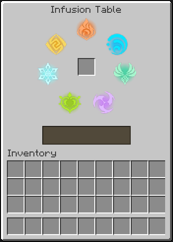

# Infusion Table

	
The <b>Infusion Table</b> is a block used to spend <a href="https://minecraft.wiki/w/Experience">experience</a> to apply an elemental infusion to items!

	

## Obtaining

### Breaking

An infusion table requires an [iron pickaxe](https://minecraft.wiki/w/Pickaxe) or better to be mined, in which case it drops itself. Otherwise, it drops nothing.

### Crafting

**for Minecraft versions that don't have the specified items, i.e. [Wind Charge](https://minecraft.wiki/w/Wind_Charge) on 1.20.1, it is excluded from the recipe.*

## Usage

	

		An item can be infused by using an infusion table and placing the item in the centered input slot. Once an item is placed, the "Infuse" button is shown.    
		To successfully infuse an item, the player must have at least 10 levels of experience. Otherwise, the Infuse button will appear disabled, and cannot be used.    
		The infusion table is 1 1/4 blocks high.
	

	

### Elemental Infusion

&nbsp; &nbsp; *Main page: [Elemental Combat/Elemental Infusion](../elements/elemental_combat.md#elemental-infusion)*

The infusion table's main purpose is to infuse items with the elements. The table can infuse **all** items with the elements.

If an item is already infused with an element, it is replaced with another random elemental infusion.