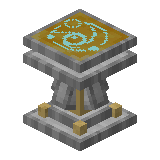
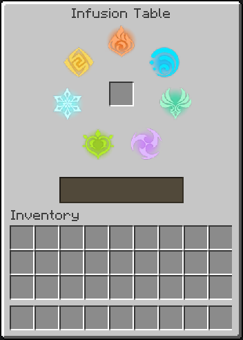

# Infusion Table

 

	
The <b>Infusion Table</b> is a block used to spend <a href="https://minecraft.wiki/w/Experience">experience</a> to apply an elemental infusion to items!

	

## Obtaining

### Breaking

An infusion table requires an [iron pickaxe](https://minecraft.wiki/w/Pickaxe) or better to be mined, in which case it drops itself. Otherwise, it drops nothing.

### Crafting

 

<CraftingRecipe>
	<Ingredient id="minecraft:wind_charge" slotId=1></Ingredient>
	<Ingredient id="minecraft:lightning_rod" slotId=2></Ingredient>
	<Ingredient tag="minecraft:leaves" slotId=3></Ingredient>
	<Ingredient id="minecraft:water_bucket" slotId=4></Ingredient>
	<Ingredient id="minecraft:block_of_gold" slotId=5></Ingredient>
	<Ingredient id="minecraft:blue_ice" slotId=6></Ingredient>
	<Ingredient id="minecraft:fire_charge" slotId=7></Ingredient>
	<Ingredient id="minecraft:smooth_stone_slab" slotId=8></Ingredient>
	<Ingredient tag="minecraft:stone_crafting_materials" slotId=9></Ingredient>
	<Ingredient id="seven-elements:infusion_table" slotId=0></Ingredient>
</CraftingRecipe>

## Usage

	

		An item can be infused by using an infusion table and placing the item in the centered input slot. Once an item is placed, the "Infuse" button is shown.    
		To successfully infuse an item, the player must have at least 10 levels of experience. Otherwise, the Infuse button will appear disabled, and cannot be used.    
		The infusion table is 1 1/4 blocks high.
	

	

### Elemental Infusion

&nbsp; &nbsp; *Main page: [Elemental Combat/Elemental Infusion](../../guide/elements/Elemental%20Combat.md#elemental-infusion)*

The infusion table's main purpose is to infuse items with the elements. The table can infuse **all** items with the elements.

If an item is already infused with an element, it is replaced with another random elemental infusion.

The elemental infusion on the item will also have a random selected amount of corresponding [Elemental Gauge Units](../../guide/elements/Elemental%20Combat.md) from either 1.0, 1.5 or 2.0.

### Removing Elemental Infusions

With a [Grindstone](https://minecraft.wiki/w/Grindstone), an item with an Elemental Infusion may be stripped of its Elemental Infusion.

Like [enchanted](https://minecraft.wiki/w/Enchanted) items, placing an infused item in either input slot of the Grindstone makes an "un-infused" item appear in the output slot. This works regardless if the item is enchanted or not.

Removing the "un-infused" item from the output slot deletes the input item and causes the Grindstone to drop some [experience](https://minecraft.wiki/w/Experience). The experience dropped is proportional to the [Gauge Units](../../guide/elements/Elemental%20Gauge%20Theory.md) the Elemental Infusion would've applied.